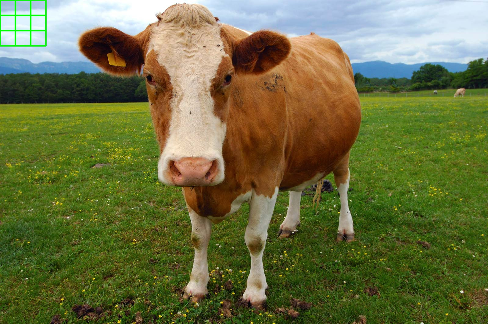

# Assignment 1 (10/13)

## OpenCV Coding

- File: `cow.py`
- Command: `$ python3 cow.py`
- Input: `img/cow.jpeg`
  
- Output: `img/cow_with_rectangle.jpeg`
  
- Effect: pop-up showing figure `img/cow_with_rectangle.jpeg`
