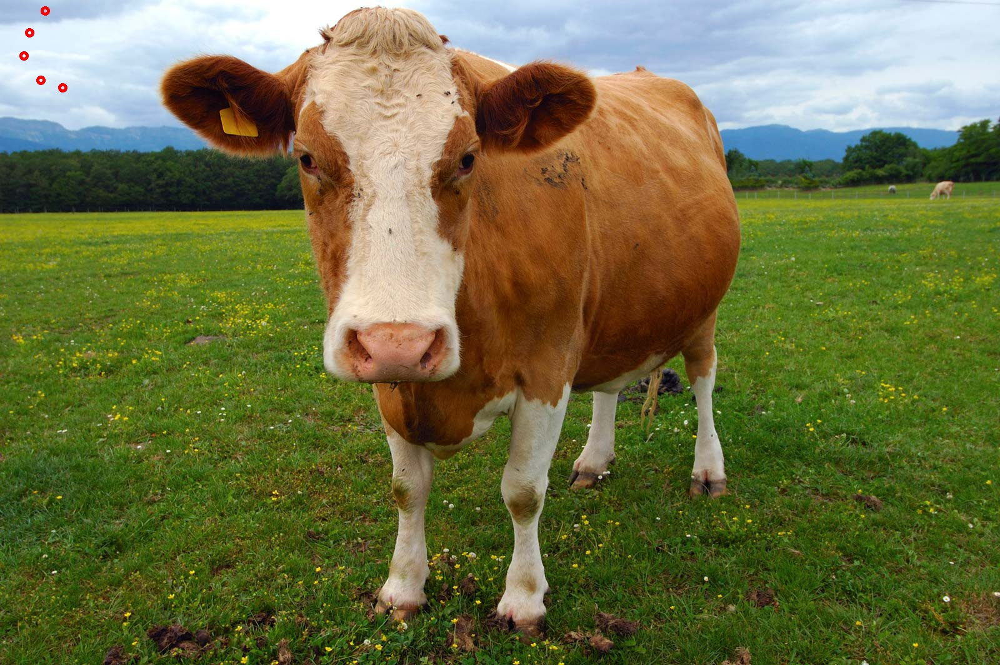

# Assignment 2 (10/20)

## OpenCV Coding

- File: `draw.py`
- Command: `$ python3 draw.py`
- Input: `img/cow.jpeg`
  
- Output:
  - `img/cow_hollow_circle.jpeg`
  
  - `img/cow_solid_circle.jpeg`
  
- Effect: pop-up showing figure `img/cow.jpeg`, waiting to draw
- Usage: press `ENTER` key to continue
