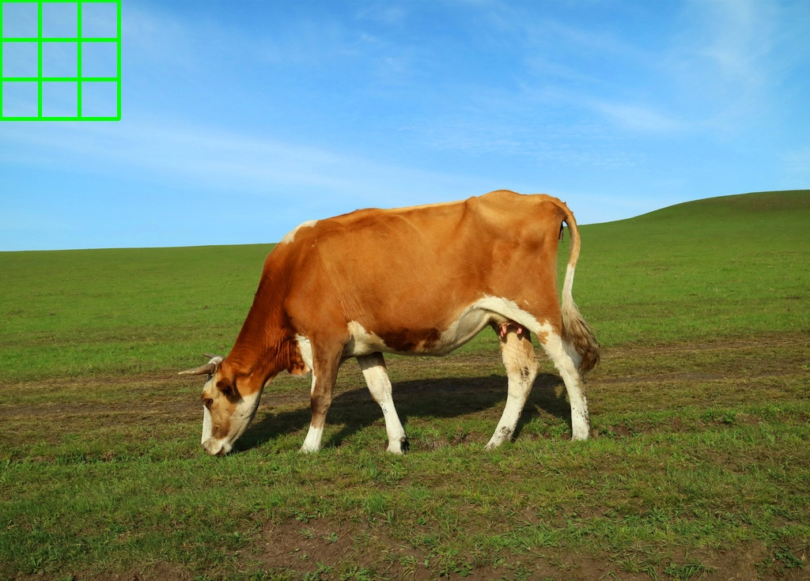

# assignment2021/10/13

## 执行的代码

```
import numpy as np  
import cv2  
img = cv2.imread('cow.jpg',1)  
for i in range(1,4):  
　for j in range(1,4):  
    cv2.rectangle(img,((i-1)*50,0),(i*50,j*50),(0,255,0),3)  
cv2.imshow('image',img)  
cv2.waitKey(0)  
cv2.destroyAllWindows()  
cv2.imwrite('cow1.jpg',img)  
```
## 实现的效果

