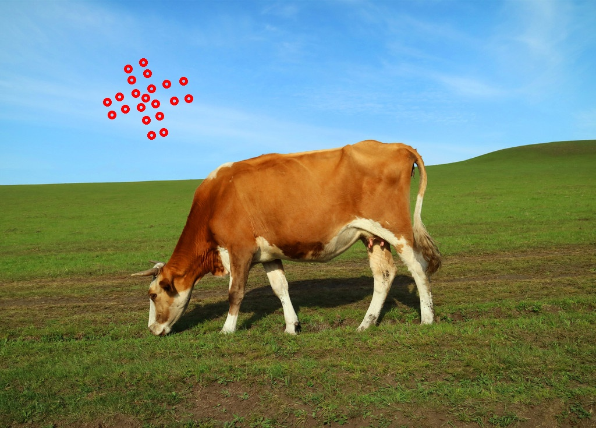

# assignment 2021/10/20
```
import numpy as np
import cv2
img = cv2.imread('cow.jpg',1) #读入牛的图片

#要求1 鼠标右键双击画直径10，线粗3的红色圆圈
def draw_circle(event,x,y,flags,param):
    if event==cv2.EVENT_RBUTTONDBLCLK:
        cv2.circle(img,(x,y),5,(0,0,255),3) 
        #在鼠标所点位置为圆心5为半径画圆圈，颜色为红色，线粗为3
cv2.namedWindow('image')#设置图形窗口
cv2.setMouseCallback('image',draw_circle)

while(1):
    cv2.imshow('image',img)
    if cv2.waitKey(20)&0xFF==27:
        break
cv2.imwrite('cow2.jpg',img)
cv2.destroyAllWindows()

#要求2 在牛图片上画直径10的实心红色圆
img = cv2.imread('cow.jpg',1) #重新加载牛图片，避免之前画的圆圈影响
def draw_circle1(event,x,y,flags,param):
    if event==cv2.EVENT_RBUTTONDBLCLK:
        cv2.circle(img,(x,y),5,(0,0,255),-1) 
        #在鼠标所点位置为圆心5为半径画圆，颜色为红色，thickness-1代表填充图形
cv2.namedWindow('image')#设置图形窗口
cv2.setMouseCallback('image',draw_circle1)

while(1):
    cv2.imshow('image',img)
    if cv2.waitKey(20)&0xFF==27:
        break
cv2.imwrite('cow3.jpg',img)
cv2.destroyAllWindows()
```
## result picture
## red circle

## red solid circle

