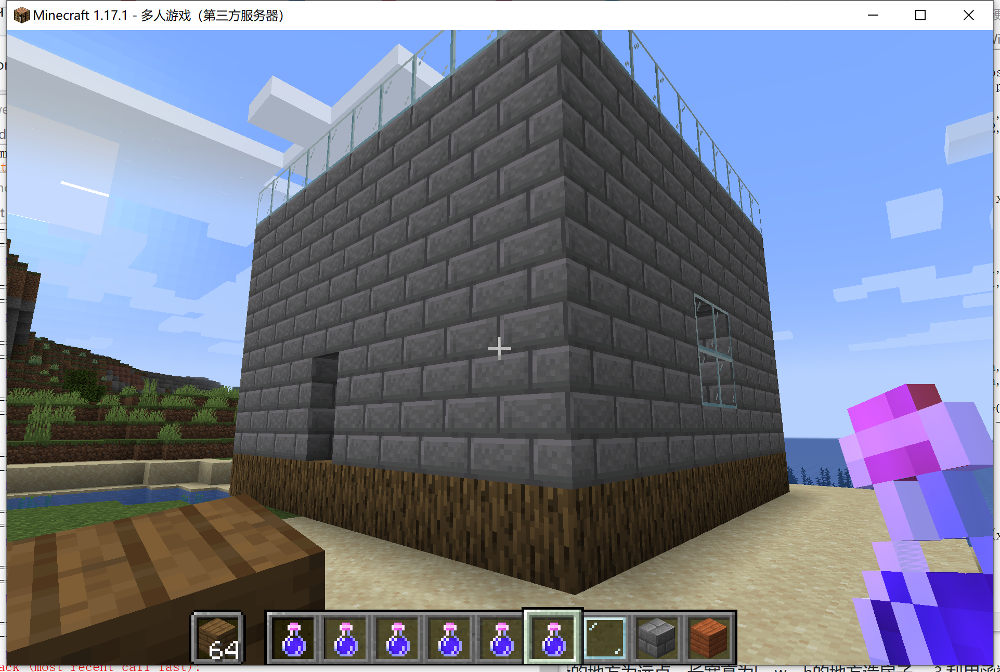
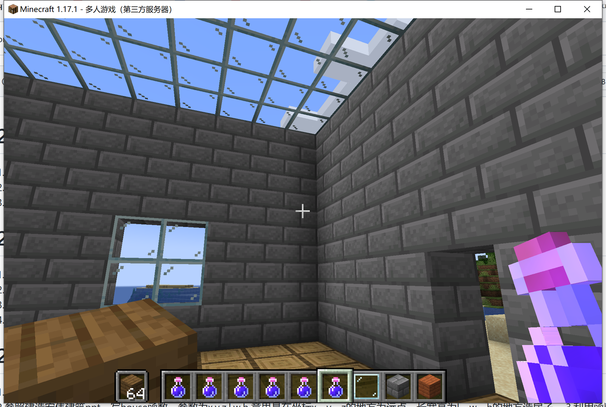
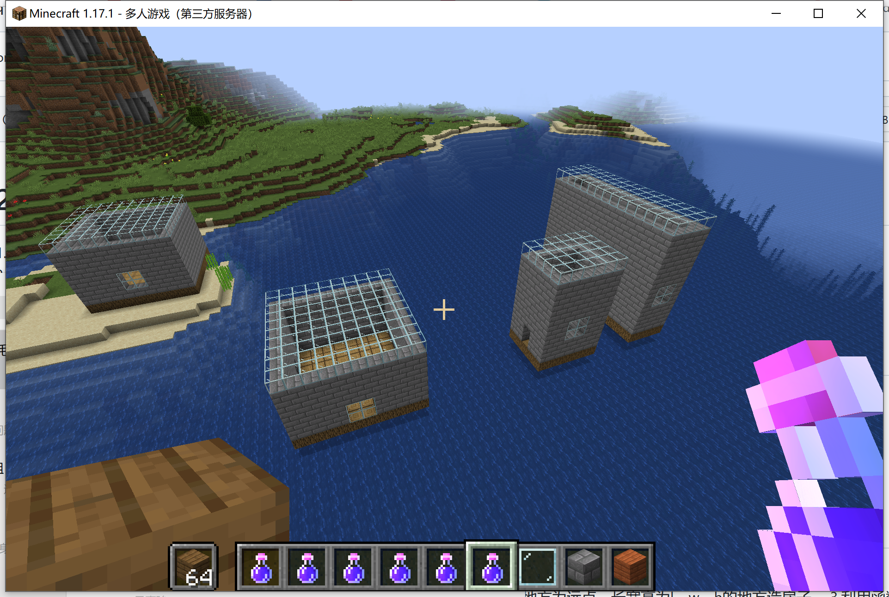

## assignment 2021/10/27

code
```python
from mcpi.minecraft import Minecraft
import time

mc=Minecraft.create()
pos=mc.player.getTilePos()

print("player pos is",pos)
# 要求1 建造10*10*6的房子
for i in range(10):
    for j in range(10):
        mc.setBlock(pos.x+i,pos.y,pos.z+1+j,17) #创造橡木地板
        mc.setBlock(pos.x+i,pos.y+7,pos.z+1+j,20)#创造玻璃天花板


#建造四周围墙
for y in range(6):
    for a in range(10):
        mc.setBlock(pos.x+a,pos.y+1+y,pos.z+1,98)
        mc.setBlock(pos.x+a,pos.y+1+y,pos.z+10,98)
    for a in range(8):
        mc.setBlock(pos.x,pos.y+1+y,pos.z+2+a,98)
        mc.setBlock(pos.x+9,pos.y+1+y,pos.z+2+a,98)
#创造空气门
mc.setBlock(pos.x+5, pos.y+1, pos.z+1,0)
mc.setBlock(pos.x+5, pos.y+2, pos.z+1,0)

#创造窗户2*2
for z in range(2):
      for y in range(2): 
            mc.setBlock(pos.x, pos.y+y+2, pos.z+z+5, 20)
#要求2 定义创建house函数
def house(x0,y0,z0,l,w,h):
    for i in range(l):
        for j in range(w):
            mc.setBlock(x0+i,y0,z0+j,17) #创造橡木地板
            mc.setBlock(x0+i,y0+h+1,z0+j,20)#创造玻璃天花板


    #建造四周围墙
    for y in range(h):
        for a in range(l):
            mc.setBlock(x0+a,y0+1+y,z0,98)
            mc.setBlock(x0+a,y0+1+y,z0+w-1,98)
        for a in range(w-2):
            mc.setBlock(x0,y0+1+y,z0+1+a,98)
            mc.setBlock(x0+l-1,y0+1+y,z0+1+a,98)
    #创造空气门
    mc.setBlock(x0+int(l/2), y0+1, z0,0)
    mc.setBlock(x0+int(l/2), y0+2, z0,0)

    #创造窗户2*2
    for z in range(2):
          for y in range(2): 
                mc.setBlock(x0, y0+y+int(h/2)-1, z0+z+int(w/2)-1, 20)
#要求3 建造一排3个房子
house(-290,-3,256,10,10,5)
house(-290,-3,276,5,6,8)
house(-290,-3,286,15,4,10)
```
## result picture
### 10* 10* 6 house



### a row of three houses

