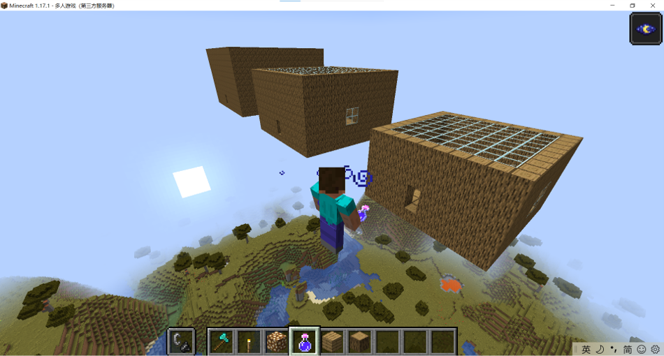

# Code for homework
```python
# 创建3个House类的实例
from mcpi.minecraft import Minecraft

class House():
# def house(x0,y0,z0,l,w,h,m=17):
    def __init__(self,x0,y0,z0,l,w,h,m=17):
    # m:material, default=17--log        
        if (min(l,w,h)<=0):
            raise AssertionError("min(l,w,h)<=0 !!!")
        self.x0 = x0
        self.y0 = y0
        self.z0 = z0
        self.l = l
        self.w = w
        self.h = h
        self.m = m
   
        #造地板
        for x in range(self.l):
            for z in range(self.w):
                mc.setBlock(self.x0+x, self.y0, self.z0+z, self.m)

        #造围墙
        for y in range(self.h):
            for x in range(self.l):
                mc.setBlock(self.x0+x, self.y0+y, self.z0, self.m)
                mc.setBlock(self.x0+x, self.y0+y, self.z0+self.w-1, self.m)
            for z in range(self.w):
                mc.setBlock(self.x0, self.y0+y, self.z0+z, self.m)
                mc.setBlock(self.x0+self.l-1, self.y0+y, self.z0+z, self.m)

        #造天花板
        for x in range(self.l-2):
            for z in range(self.w-2):
                mc.setBlock(self.x0+x+1, self.y0+self.h-1, self.z0+z+1, 20) # glass

        #造门
        mc.setBlock(self.x0+self.l//2, self.y0+1, self.z0,0) # air
        mc.setBlock(self.x0+self.l//2, self.y0+2, self.z0,0)

        #造窗户
        for z in range(2):
            for y in range(2): 
                    mc.setBlock(self.x0, self.y0+self.h//2+y-1, self.z0+self.w//2+z-1, 20) #glass


mc=Minecraft.create()
pos=mc.player.getTilePos()

x0 = pos.x
y0 = pos.y
z0 = pos.z


house1 = House(x0,y0,z0,10,10,6)
house2 = House(x0+20,y0,z0,15,15,9)
house3 = House(x0+20+25,y0,z0,20,20,12)
```
## result

